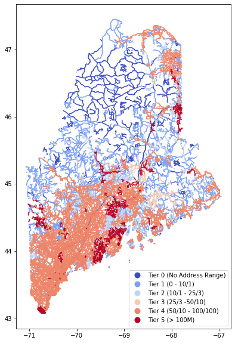
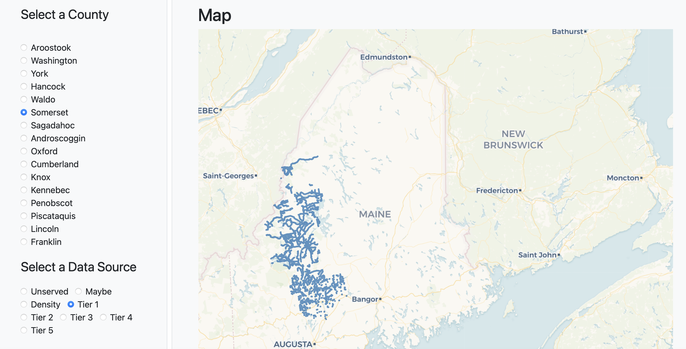

# broadband
A student project at the [Roux Institute](https://roux.northeastern.edu/) in support of the [Maine Connectivity Authority](https://www.maineconnectivity.org/) (MCA).

## Overview
This repository aims to visualize and explore broadband access in Maine. Current broadband access varies across Maine, creating the need for county-level and state-level data visuals to provide support for the MCA's projects. 

### State-level

This visualization represents the MCA's current broadband investments throughout the state. The different tiers demonstrate varying levels of broadband access, with 0 being the lowest level of access and 5 being the highest.

### County-level 

This interactive visualization represents the MCA's current broadband investments on a county-level. The different layers show underserved areas, maybe underserved areas, density of unserved areas, as well as the same access-tiers as the state-level visual. 

The map is able to be interacted with in the browser, allowing the user to select the county and relevant layers. Please view the interactive map [here](https://ds5010.github.io/broadband/).

## Data
The data used to generate the layers is geospatial data provided by the MCA. 

The geospatial data was originally provided in a single file for the entire state of Maine. In order to create the interactive county-level map, the team subsetted the data by county.

Steps:

1. Obtain county-level geospatial data from the [US Census API](https://www.census.gov/data/developers/data-sets.html).
2. Process the data to generate the polygon-objects needed to separate the MCA's data into counties. Sub-steps for this process are to:
    1. Query API URL
    2. Decode the data and unload it as json
    3. Transfer json into a pandas dataframe
    4. Load the geopandas counties and merge the pandas dataframe in
    
    For more details, please refer to the `add_census.py ` and `Maine_County_Boundary_Polygons_Dissolved_Feature_Census_Merge.geojson` files.

3. Subset the MCA data by county. Sub-steps for this process are to:
    1. Read in the county data from Step 2.
    2. Create a dictionary where each key is a county and the value is the geometry of the county.
    3. For each entry in the dictionary (for each county), read in the MCA layer, determine which data points are within that county, and save the new layer in a folder specific to that county. This process repeats for each of the counties. 

    The subsetting script will first create a directory for each county, and then populate all of the geospatial data for that county (one geojson file for each tier/file provided by the MCA). Please refer to `split_by_maine_county.py` for details. 

To view the data, please refer to the [county](./county) directory of this repository. Please refer to the [zipfiles](./zipfiles) directory for the raw data provided by the MCA.

## Running The Code 

A [Makefile](./Makefile) has been created to streamline code compilation. To execute, clone the vaccines repository to your local drive & run the makefile outlined below.

***(need to expand this if this is the direction we want to go in)***

1. 

## Analysis
This space is reserved for further commentary pending conversation with the stakeholders.

### Future Considerations

***(need to add this info if we want it)***

### Acknowledgements
Developed by DS5010 Spring 2022 class, Prof. Philip Bogden, Roux Institute, Northeastern University.

Data and guidance provided by [Maine Connectivity Authority](https://www.maineconnectivity.org).