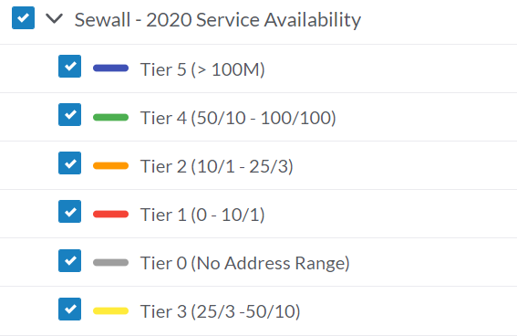
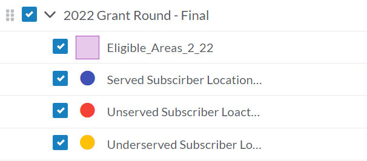
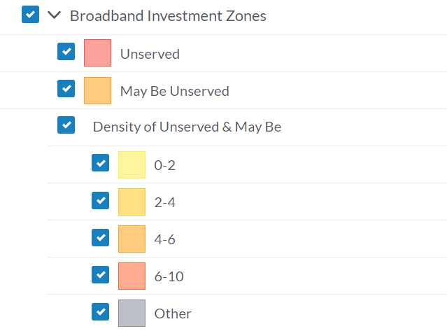

# broadband

More info here: http://github.com/pbogden/broadband

## Goals

* Represent current investments 
* Demonstrate community readiness
* Highlight unconnected / unserved areas
* Demonstrate connectivity in context of other socio-economic demographics
* Representation of wireless offerings in context of unconnected / unserved.  

## Data

Right now, there are 3 data sources:

1. Sewall data -- Okay for public use

2. Grant rounds data -- NOT FOR PUBLIC USE
* Polygons (eligible areas) -- These *can* be used

3. Broadband Investment Zone data -- Okay for public use

## Related sites

* StoryMap made by Sewall https://storymaps.arcgis.com/stories/c0571d8a3ccb4116acd0f84eb18ad52e
* "Dashboard" made for Waldo County https://experience.arcgis.com/experience/914684b75a1049fabec5e9840ebd7c62

