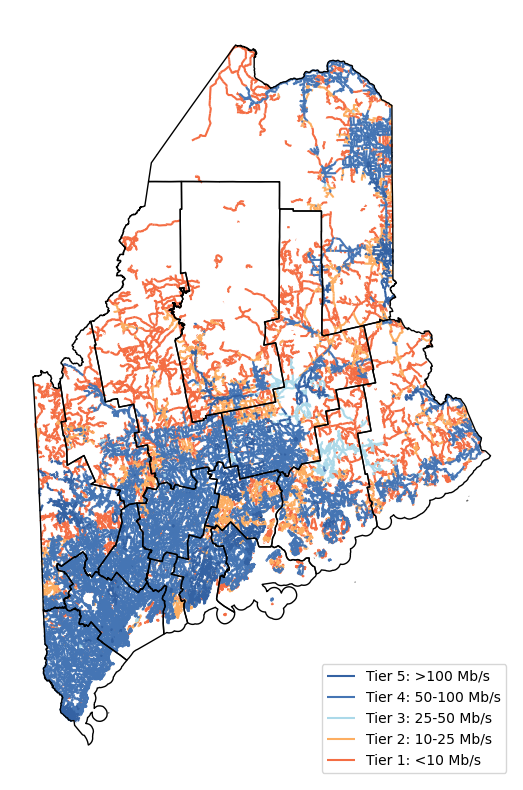

# broadband
Developed by DS5010 students at [The Roux Institute](https://roux.northeastern.edu/), Northeastern University, Spring 2022.

Data and guidance provided by [Maine Connectivity Authority](https://www.maineconnectivity.org/).

## Overview
This repository aims to visualize and explore broadband access in Maine. Current broadband access varies across Maine, creating the need for county-level and state-level data visuals to provide support for the MCA's projects. 

### State-level


This visualization represents current broadband speeds throughout the state, with Tier 0 (in blue) representing no access, ranging to Tier 5 (in red) representing the fastest access speed.

### County-level 


This interactive visualization represents the MCA's current broadband investments on a county-level. The different layers show underserved areas, maybe underserved areas, density of unserved areas, as well as the same access-tiers as the state-level visual. 

The map is able to be interacted with in the browser, allowing the user to select the county and relevant layers. Please view the interactive map [here](https://ds5010.github.io/broadband/).

## Data

The data used to generate the layers is geospatial data provided by the MCA. 

The geospatial data was originally provided in a single file for the entire state of Maine. In order to create the interactive county-level map, the team subsetted the data by county.

Steps Taken:

1. Obtained county boundaries from [Maine Office of GIS](https://maine.hub.arcgis.com/datasets/ec1a999644cf4e128c84d207f6b8e2bc).
2. Processed the data to generate the polygon-objects needed to separate the MCA's data into counties. Sub-steps for this process are to:
    1. Query API URL
    2. Decode the data and unload it as json
    3. Transfer json into a geopandas dataframe
    4. Load the geopandas counties and merge the pandas dataframe

3. Subset the MCA data by county. Sub-steps for this process are to:
    1. Read in the county data from Step 2.
    2. Create a dictionary where each key is a county and the value is the geometry of the county.
    3. For each entry in the dictionary (for each county), read in the MCA layer, determine which data points are within that county, and save the new layer in a folder specific to that county. This process repeats for each of the counties. 

    The subsetting script will first create a directory for each county, and then populate all of the geospatial data for that county (one geojson file for each tier/file provided by the MCA). Please refer to `split_by_maine_county.py` for details. 

To view the resulting data, please refer to the [county](./county) directory of this repository. Please refer to the [zipfiles](./zipfiles) directory for the raw data provided by the MCA.

## Running The Code (Updating Data, etc.)

A [Makefile](./Makefile) has been created to streamline code compilation.

0. Activate a python environment with geopandas installed.
1. Overwrite raw data files in ['src/raw_data'](src/raw_data/) with any updated data.
2. Run ```make split``` to split all files by county and update the data subsets in the ['county/'](county/) subdirectory.

This process will take several minutes to complete.

There is also a make recipe (```make dev```) for running a development server for the purposes of updating the gh-pages site.